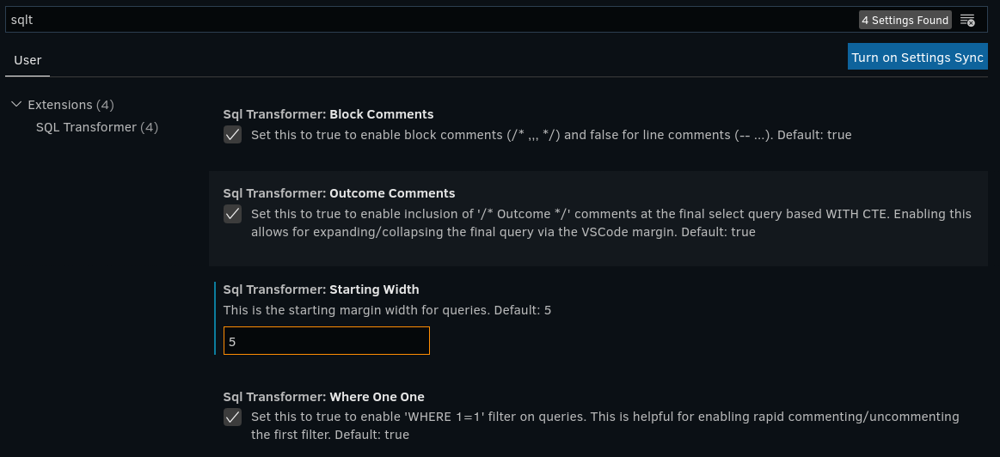

# SQL Transformer

Transform your SQL!

## Introduction

`SQL Transformer` formats SQL to more organized and readable code. Heavy focus was made on improving developer productivity and clarity. It works with common table expressions (CTEs) as well as complicated inline SQL.

The code is heavily commented in case you are eager to understand how it works, or want to make updates or contributions. This has been tested with SQL that ranges from tens of lines to thousands of lines of SQL containing complex CTE and inline logic.

This release is ready for broad use on most SQL, and has been tested with SQL that ranges from tens of lines to thousands of lines of SQL containing complex CTE and inline logic. Feedback is welcomed!

## Usage

1. Select your SQL code block.
2. Execute `SQL Transformer: Format SQL` from the command palette.
3. Or, use a keyboard shortcut:
   * Windows: `Shift` + `Alt` + `T`
   * Mac: `Shift` + `Ctrl` + `T`

## Configuration

There are two user settings for configuring SQL Transformer output:



  - **Block Comments**: *boolean* for specifying block or dash comments
    - This is currently defaulted to block margins
    - Targeting dash comments for the default, however it hasn't been tested as heavily yet.
    - See style example(s) below

  - **Outcome Comments**: *boolean* to include/exclude OUTCOME comments on CTE queries
    - This is currently defaulted to include OUTCOME comments
    - See style example(s) below

  - **Starting Width**: *integer* for specifying starting select margin
    - Current default margin is set to 5
    - Setting to 5 or greater allows for aligning the query on the first attribute, while capitalizing on VSCode's margin collapse functionality

  - **Where One One**: *boolean* to include/exclude 'WHERE 1=1' filters
    - Current default is to include

## SQL style example

Formatted by `SQL Transformer` with multiple single line comment blocks.

```sql
INSERT INTO target_tab
    ( monthly
    , a
    , max_b
    , max_c
    , sum_cnt
    , some_case
     )
WITH
    cte_1 AS (SELECT a.k_1
                   , a.k_2
                   , max(a.col) AS max_col
                FROM tab_d a
                JOIN tab_f b
                  ON(a.k_1 = b.k_1
                 AND a.k_2 = b.k_2
                 AND a.k_3 = b.k_3
                 AND a.k_4 = b.k_4)
            GROUP BY a.k_1
                   , a.k_2
             ),
    
    cte_2 AS (SELECT a.k
                   , max(b.v) AS max_v
                   , avg(c.v) AS avg_v
                   , min(d.v) AS min_v
                   , count(e.v) AS cnt
                FROM tab_e a
                JOIN tab_f b
                  ON a.k = b.k
           LEFT JOIN tab_g c
                  ON a.k = c.k
           LEFT JOIN tab_h d
                  ON a.k = d.k
           LEFT JOIN tab_i e
                  ON a.k = e.k
            GROUP BY a)
/* Outcome */
    SELECT from_timestamp(from_utc_timestamp(from_unixtime(cast(dttm/1000 AS bigint)), 'ROK'), 'yyyy-mm') AS monthly
         , a.a
           /* double-dashed comments will be replaced like C-style comments. */
         , max(a.b) AS max_b
           /* * */
           /* * multi */
           /* * line */
           /* * comments */
           /* * will be transformed into multiple single-line comments. */
         , max(a.c) AS max_c
         , sum(b.cnt) AS sum_cnt
         , nvl(cast(max(CASE WHEN a.cnt > 0
                              AND b.max_v > 0 THEN 'A'
                             WHEN a.cnt > 0
                              AND b.max_v < 0 THEN 'B'
                             WHEN a.cnt < 0 THEN 'C'
                             WHEN a.cnt < 0 THEN 'D'
                             ELSE (SELECT max(CASE WHEN a.k_1 is null
                                                   THEN 'A'
                                                   WHEN a.k_1 > 'V'
                                                   THEN 'A'
                                                   ELSE 'B'
                                              END) AS v
                                     FROM cte_1 a
                                    WHERE 1=1
                                      AND a.max_col > 120
                                      AND a.type IN  (SELECT type
                                                        FROM tab_t)
                                      AND a.type IN('A', 'B', 'C', 'D'))
                        END) AS STRING), '') AS some_case
      FROM (SELECT a.k
                   /* Reserved words in comments are treated as comments. */
                 , b.v
                 , c.max_v
                 , c.avg_v
                 , c.min_v
                 , c.cnt
              FROM tab_a a
              JOIN tab_b b
                ON(a.k = b.k
               AND b.d = 'dd')
                   /* + shuffle */
         LEFT JOIN cte_2 c
                ON a.c = c.a
             WHERE 1=1
               AND a.col_1 >= 'filter'
                   /* comment */
               AND b.col_2 BETWEEN 'fil'
                               AND 'ter'
               AND a.col_2 > 0) a
 LEFT JOIN (SELECT a.k
                 , max(v) AS max_v
              FROM tab_c a
             WHERE 1=1
               AND a.d >= 'filter'
          GROUP BY a.k
            HAVING count(1) > 0
           ) b
        ON a.k = b.k
  GROUP BY 1, 2
  ORDER BY 1, 2
;
```

Formatted by `SQL Transformer` with comment line blocks.

```sql
INSERT INTO target_tab
    ( monthly
    , a
    , max_b
    , max_c
    , sum_cnt
    , some_case
     )
WITH
    cte_1 AS (SELECT a.k_1
                   , a.k_2
                   , max(a.col) AS max_col
                FROM tab_d a
                JOIN tab_f b
                  ON(a.k_1 = b.k_1
                 AND a.k_2 = b.k_2
                 AND a.k_3 = b.k_3
                 AND a.k_4 = b.k_4)
            GROUP BY a.k_1
                   , a.k_2
             ),
    
    cte_2 AS (SELECT a.k
                   , max(b.v) AS max_v
                   , avg(c.v) AS avg_v
                   , min(d.v) AS min_v
                   , count(e.v) AS cnt
                FROM tab_e a
                JOIN tab_f b
                  ON a.k = b.k
           LEFT JOIN tab_g c
                  ON a.k = c.k
           LEFT JOIN tab_h d
                  ON a.k = d.k
           LEFT JOIN tab_i e
                  ON a.k = e.k
            GROUP BY a)
--  Outcome
    SELECT from_timestamp(from_utc_timestamp(from_unixtime(cast(dttm/1000 AS bigint)), 'ROK'), 'yyyy-mm') AS monthly
         , a.a
           --  double-dashed comments will be replaced like C-style comments.
         , max(a.b) AS max_b
           --  *
           --  * multi
           --  * line
           --  * comments
           --  * will be transformed into multiple single-line comments.
         , max(a.c) AS max_c
         , sum(b.cnt) AS sum_cnt
         , nvl(cast(max(CASE WHEN a.cnt > 0
                              AND b.max_v > 0 THEN 'A'
                             WHEN a.cnt > 0
                              AND b.max_v < 0 THEN 'B'
                             WHEN a.cnt < 0 THEN 'C'
                             WHEN a.cnt < 0 THEN 'D'
                             ELSE (SELECT max(CASE WHEN a.k_1 is null
                                                   THEN 'A'
                                                   WHEN a.k_1 > 'V'
                                                   THEN 'A'
                                                   ELSE 'B'
                                              END) AS v
                                     FROM cte_1 a
                                    WHERE 1=1
                                      AND a.max_col > 120
                                      AND a.type IN  (SELECT type
                                                        FROM tab_t)
                                      AND a.type IN('A', 'B', 'C', 'D'))
                        END) AS STRING), '') AS some_case
      FROM (SELECT a.k
                   --  Reserved words in comments are treated as comments.
                 , b.v
                 , c.max_v
                 , c.avg_v
                 , c.min_v
                 , c.cnt
              FROM tab_a a
              JOIN tab_b b
                ON(a.k = b.k
               AND b.d = 'dd')
                   --  + shuffle
         LEFT JOIN cte_2 c
                ON a.c = c.a
             WHERE 1=1
               AND a.col_1 >= 'filter'
                   --  comment
               AND b.col_2 BETWEEN 'fil'
                               AND 'ter'
               AND a.col_2 > 0) a
 LEFT JOIN (SELECT a.k
                 , max(v) AS max_v
              FROM tab_c a
             WHERE 1=1
               AND a.d >= 'filter'
          GROUP BY a.k
            HAVING count(1) > 0
           ) b
        ON a.k = b.k
  GROUP BY 1, 2
  ORDER BY 1, 2
;
```

## Todo

Update and enhance as necessary to:
* include VSCode user settings for adjusting output preferences
* improve Snowflake SQL compatibility
* work seamlessly with DBT (Data Build Tool)

## Testing Changes

Run `npm run test` to test code changes on our sample.sql file

## Credits

Thanks for the inspiration and examples:
* Opensource: https://opensource.com/article/20/6/vs-code-extension
* Hello World Minimal Sample: https://github.com/microsoft/vscode-extension-samples/tree/main/helloworld-minimal-sample
* Sql Styler: https://github.com/oboki/sql-styler
* Prettier: https://github.com/prettier/prettier-vscode.git
